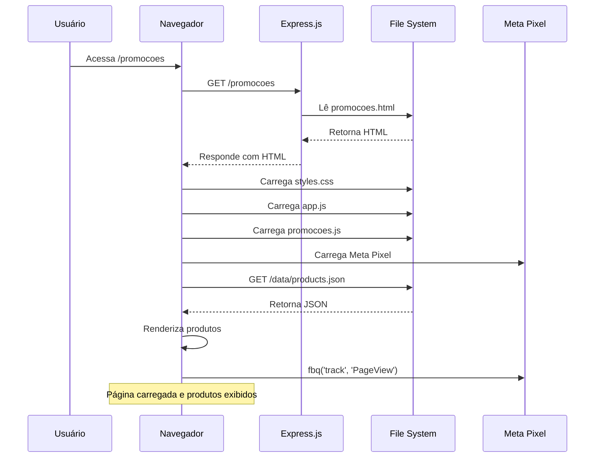
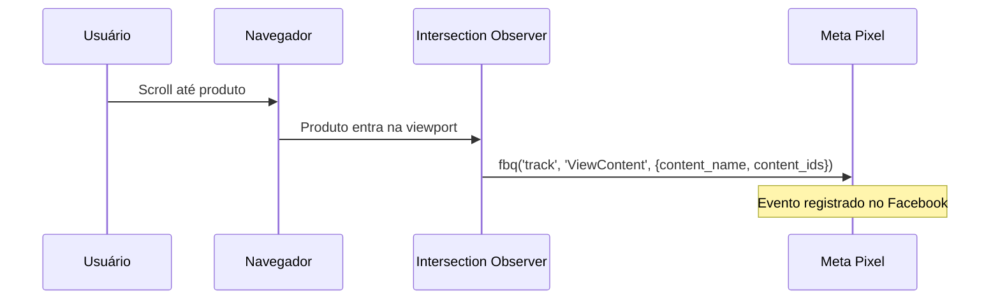
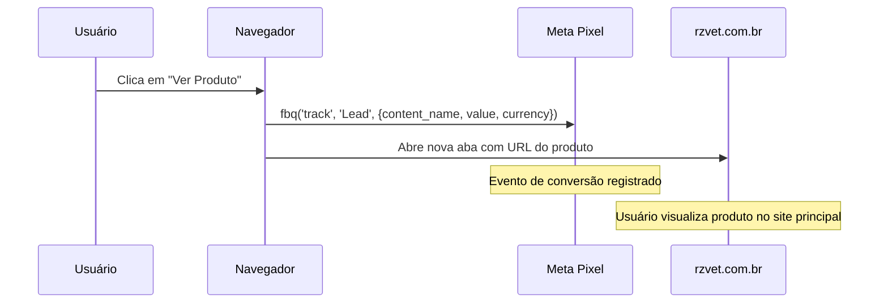

# Landing Page Black Friday RZ VET - Architecture Document

**Versão:** 1.2  
**Data:** 13 de Novembro de 2025  
**Status:** ✅ IMPLEMENTADO - Fase 1 e Fase 2 Concluídas

---

## 1. Introduction

Este documento descreve a arquitetura técnica para a implementação da página de promoções da Black Friday RZ VET. O projeto consiste em adicionar uma nova página estática ao sistema existente, mantendo total compatibilidade com a infraestrutura atual e reutilizando componentes, estilos e funcionalidades já estabelecidas.

**Relacionamento com Frontend Architecture:**
Este documento foca na arquitetura geral do sistema e integração backend. Uma especificação de front-end separada será criada para detalhar os componentes visuais, wireframes e diretrizes de design específicas da interface.

### 1.1 Starter Template or Existing Project

**Projeto Existente (Brownfield):**
Este projeto é uma extensão de um sistema existente que já possui:
- Servidor Express.js configurado
- Landing page funcional em `public/index.html`
- Sistema de captura de leads com integração Google Sheets
- Meta Pixel integrado
- Estrutura de CSS e JavaScript estabelecida

A nova página de promoções será adicionada como uma página estática adicional, reutilizando toda a infraestrutura existente sem modificações no código atual.

### 1.2 Change Log

| Date       | Version | Description                                    | Author        |
| ---------- | ------- | ---------------------------------------------- | ------------- |
| 2025-11-13 | 1.1     | ✅ Implementação Fase 1 concluída              | Equipe RZ VET |
| 2025-11-13 | 1.0     | Criação inicial da arquitetura técnica         | Equipe RZ VET |

---

## 2. High Level Architecture

### 2.1 Technical Summary

A arquitetura segue um modelo **monolítico simples** com servidor Express.js servindo páginas estáticas e uma API REST para leads. A nova página de promoções será implementada como uma página HTML estática adicional (`public/promocoes.html`), servida pelo mesmo servidor Express.js existente. A página consumirá dados de produtos de um arquivo JSON estático (`public/data/products.json`) e reutilizará completamente os estilos CSS, JavaScript e componentes da landing page atual. A integração com Meta Pixel será mantida e estendida para rastrear eventos específicos de visualização de produtos e cliques. Esta abordagem garante zero impacto no sistema existente, máxima reutilização de código e facilidade de manutenção.

### 2.2 High Level Overview

**Estilo Arquitetural:** Monolito simples com páginas estáticas

**Estrutura de Repositório:** Monorepo (conforme PRD)
- Frontend em `public/`
- Backend em `server/`
- Dados estáticos em `public/data/`

**Arquitetura de Serviços:**
- Express.js servindo arquivos estáticos
- API REST existente para leads (mantida intacta)
- Nova rota estática para página de promoções

**Fluxo Principal:**
1. Usuário acessa `/promocoes` (ou rota definida)
2. Express.js serve `public/promocoes.html`
3. Página carrega CSS e JS existentes
4. JavaScript carrega `public/data/products.json`
5. Produtos são renderizados dinamicamente
6. Interações disparam eventos Meta Pixel
7. Cliques em "Ver Produto" redirecionam para rzvet.com.br

**Decisões Arquiteturais Principais:**
- **Reutilização Total:** CSS, JS e componentes da landing page atual
- **Dados Estáticos:** JSON para MVP (facilita atualização sem deploy)
- **Isolamento:** Nova página não modifica código existente
- **Performance:** Lazy loading de imagens, otimização WebP

### 2.3 High Level Project Diagram

```mermaid
graph TB
    User[Usuário/Navegador] -->|GET /promocoes| Express[Express.js Server]
    Express -->|Serve| HTML[promocoes.html]
    HTML -->|Carrega| CSS[styles.css existente]
    HTML -->|Carrega| JS[app.js existente + promocoes.js]
    HTML -->|Carrega| MetaPixel[Meta Pixel Code]
    
    JS -->|Fetch| JSON[products.json]
    JSON -->|Dados| JS
    JS -->|Renderiza| Cards[Product Cards]
    
    Cards -->|Click| Link[rzvet.com.br/produto]
    Cards -->|View| MetaPixel
    Cards -->|Click CTA| MetaPixel
    
    Express -->|API| LeadsAPI[/api/leads - mantida]
    LeadsAPI -->|Salva| Storage[Local Storage + Google Sheets]
    
    style HTML fill:#dc2626
    style Express fill:#991b1b
    style JSON fill:#f87171
    style MetaPixel fill:#3b82f6
```

### 2.4 Architectural and Design Patterns

- **Static Site Generation (SSG):** Página HTML estática com dados dinâmicos via JavaScript
  - _Rationale:_ Simplicidade, performance, facilidade de deploy, alinhado com arquitetura existente

- **Component-Based Frontend:** Reutilização de componentes CSS e padrões JavaScript existentes
  - _Rationale:_ Consistência visual garantida, menor manutenção, aproveitamento de código testado

- **Data-Driven Rendering:** Dados em JSON, renderização client-side
  - _Rationale:_ Facilita atualização de produtos sem modificar código, flexível para MVP

- **Progressive Enhancement:** Funcionalidade básica funciona sem JS, melhorias com JS
  - _Rationale:_ Acessibilidade, SEO, resiliência

- **Separation of Concerns:** HTML estrutura, CSS apresentação, JS comportamento
  - _Rationale:_ Manutenibilidade, alinhado com padrões web modernos

---

## 3. Tech Stack

### 3.1 Cloud Infrastructure

- **Provider:** VPS Hostinger (infraestrutura existente)
- **Key Services:** Servidor Node.js, Express.js
- **Deployment Regions:** Brasil (São Paulo)

### 3.2 Technology Stack Table

| Category           | Technology | Version | Purpose                                    | Rationale                                           |
| ------------------ | ---------- | ------- | ------------------------------------------ | ---------------------------------------------------- |
| **Runtime**        | Node.js    | 18+     | Servidor backend                           | Versão LTS, compatível com projeto existente         |
| **Framework**       | Express.js | 5.1.0   | Servidor web e roteamento                  | Já configurado no projeto, serve arquivos estáticos |
| **Frontend**       | HTML5      | -       | Estrutura da página                        | Semântico, acessível                                 |
| **Styling**        | CSS3       | -      | Estilização (reutilizar styles.css)       | Sem frameworks, puro CSS, consistência visual       |
| **Scripting**       | JavaScript | ES6+    | Lógica client-side                         | Vanilla JS, reutilizar funções existentes           |
| **Data Format**    | JSON       | -       | Dados dos produtos                         | Simples, fácil de atualizar, sem necessidade de DB  |
| **Logging**        | Pino       | 9.4.0   | Logging estruturado                        | Já em uso no projeto                                 |
| **HTTP Client**     | Axios      | 1.13.2  | Requisições HTTP (se necessário)           | Já em uso no projeto                                 |
| **Package Manager** | npm        | 9+      | Gerenciamento de dependências              | Padrão Node.js                                       |
| **Version Control** | Git        | -       | Controle de versão                         | Padrão do projeto                                    |

**Nota:** Não serão adicionadas novas dependências. Todo o desenvolvimento utilizará tecnologias já presentes no projeto.

---

## 4. Data Models

### 4.1 Product Model

**Purpose:** Representa um produto em promoção na Black Friday

**Key Attributes:**
- `id`: string - Identificador único do produto (ex: "monitor-rm1200")
- `name`: string - Nome completo do produto (ex: "Monitor RM1200")
- `slug`: string - Slug para URL (ex: "monitor-rm1200")
- `image`: string - Caminho relativo para imagem (ex: "/valores-black/monitor-rm1200.png")
- `price_original`: number (opcional) - Preço original em reais (ex: 15000.00)
- `price_promotional`: number - Preço promocional em reais (ex: 10500.00)
- `discount_percentage`: number - Percentual de desconto (ex: 30)
- `url`: string - URL completa para página do produto em rzvet.com.br
- `specifications`: array<string> - Array de especificações principais (ex: ["Tela 12.1 polegadas", "Bateria interna"])
- `description`: string (opcional) - Descrição breve do produto
- `available`: boolean - Se o produto está disponível (true/false)

**Relationships:**
- Nenhuma (modelo independente, dados estáticos)

**Exemplo de Estrutura JSON:**
```json
{
  "id": "monitor-rm1200",
  "name": "Monitor RM1200",
  "slug": "monitor-rm1200",
  "image": "/valores-black/monitor-rm1200.png",
  "price_original": 15000.00,
  "price_promotional": 10500.00,
  "discount_percentage": 30,
  "url": "https://rzvet.com.br/produto/monitor-rm1200",
  "specifications": [
    "Tela 12.1 polegadas",
    "Bateria interna",
    "Portátil"
  ],
  "description": "Monitor multiparamétrico portátil",
  "available": true
}
```

---

## 5. Components

### 5.1 Express.js Server (Existente)

**Responsibility:** Servir arquivos estáticos e API REST

**Key Interfaces:**
- `GET /` - Serve `public/promocoes.html` (página de promoções - IMPLEMENTADO)
- `GET /api/health` - Health check endpoint
- `POST /api/leads` - API de captura de leads (mantida)

**Dependencies:** Node.js, Express.js, middleware CORS, static file serving

**Technology Stack:** Express.js 5.1.0, Node.js 18+

**Modificações Necessárias:**
- Adicionar rota para `/promocoes` que serve `public/promocoes.html`
- Manter todas as rotas existentes intactas

### 5.2 Static File Server (Existente)

**Responsibility:** Servir arquivos CSS, JS, imagens e dados JSON

**Key Interfaces:**
- `GET /styles.css` - CSS da landing page (reutilizado)
- `GET /app.js` - JavaScript da landing page (reutilizado)
- `GET /data/products.json` - Dados dos produtos (novo)
- `GET /valores-black/*.png` - Imagens dos produtos (existentes)

**Dependencies:** Express.js static middleware

**Technology Stack:** Express.js static file serving

### 5.3 Products Data Service (Novo)

**Responsibility:** Fornecer dados dos produtos para renderização

**Key Interfaces:**
- Arquivo JSON estático: `public/data/products.json`
- Estrutura: Array de objetos Product

**Dependencies:** Nenhuma (arquivo estático)

**Technology Stack:** JSON, File System

**Implementação:**
- Arquivo JSON criado manualmente/automaticamente
- Carregado via `fetch()` no JavaScript client-side
- Sem necessidade de API ou banco de dados

### 5.4 Frontend Rendering Engine (Novo)

**Responsibility:** Renderizar produtos dinamicamente na página

**Key Interfaces:**
- `loadProducts()` - Carrega dados de `products.json`
- `renderProductCard(product)` - Renderiza card individual
- `formatPrice(price)` - Formata preço em Real brasileiro
- `initializeCountdown()` - Inicializa contador (reutilizar função existente)

**Dependencies:** 
- `products.json` (dados)
- `styles.css` (estilos)
- Funções JavaScript existentes (countdown)

**Technology Stack:** JavaScript ES6+, DOM API

**Localização:** `public/promocoes.js` (novo arquivo) ou extensão de `app.js`

### 5.5 Meta Pixel Integration (Existente - Estendido)

**Responsibility:** Rastrear eventos de visualização e cliques

**Key Interfaces:**
- `fbq('track', 'ViewContent', {...})` - Quando produto entra na viewport
- `fbq('track', 'Lead', {...})` - Quando botão "Ver Produto" é clicado

**Dependencies:** Meta Pixel script (já presente no HTML)

**Technology Stack:** Meta Pixel JavaScript SDK

**Modificações Necessárias:**
- Adicionar eventos específicos para produtos
- Usar Intersection Observer para detectar visualizações
- Manter código existente intacto

---

## 6. External APIs

### 6.1 Meta Pixel API

- **Purpose:** Rastreamento de conversões e eventos para campanhas publicitárias
- **Documentation:** https://developers.facebook.com/docs/meta-pixel
- **Base URL(s):** `https://connect.facebook.net/en_US/fbevents.js`
- **Authentication:** Pixel ID configurado no código (1549329092757043)
- **Rate Limits:** Não aplicável (client-side tracking)

**Key Endpoints Used:**
- `fbq('init', pixelId)` - Inicialização do pixel (já implementado)
- `fbq('track', 'PageView')` - Visualização de página (já implementado)
- `fbq('track', 'ViewContent', {...})` - Visualização de produto (novo)
- `fbq('track', 'Lead', {...})` - Clique em "Ver Produto" (novo)

**Integration Notes:**
- Código já presente no HTML existente
- Apenas adicionar novos eventos, sem modificar código existente
- Tratamento de erro caso pixel não carregue

### 6.2 RZ VET Website (rzvet.com.br)

- **Purpose:** Redirecionamento para páginas de produto
- **Documentation:** N/A (site externo)
- **Base URL(s):** `https://rzvet.com.br`
- **Authentication:** Nenhuma (links públicos)
- **Rate Limits:** N/A

**Key Endpoints Used:**
- `GET /produto/{slug}` - Página de produto individual

**Integration Notes:**
- Links externos, abrem em nova aba
- URLs devem ser validadas antes do deploy (Story 3.3)
- Placeholders podem ser usados durante desenvolvimento

---

## 7. Core Workflows

### 7.1 Workflow: Carregamento da Página de Promoções



### 7.2 Workflow: Visualização de Produto e Tracking



### 7.3 Workflow: Clique em "Ver Produto"



---

## 8. REST API Spec

**Nota:** Este projeto não adiciona novos endpoints REST. A API existente (`/api/leads`) é mantida intacta. A página de promoções é totalmente client-side, consumindo apenas dados estáticos (JSON).

Se no futuro for necessário um endpoint para produtos dinâmicos, pode ser adicionado:

```yaml
openapi: 3.0.0
info:
  title: RZ VET Black Friday API
  version: 1.0.0
  description: API para página de promoções Black Friday (futuro - não implementado no MVP)
servers:
  - url: http://localhost:8788/api
    description: Servidor local de desenvolvimento
paths:
  /products:
    get:
      summary: Lista todos os produtos em promoção
      description: Retorna array de produtos (futuro - MVP usa JSON estático)
      responses:
        '200':
          description: Lista de produtos
          content:
            application/json:
              schema:
                type: array
                items:
                  $ref: '#/components/schemas/Product'
```

**Status:** Não implementado no MVP. Dados via JSON estático.

---

## 9. Database Schema

**Nota:** Este projeto não utiliza banco de dados. Dados dos produtos são armazenados em arquivos JSON estáticos.

**Estrutura de Dados:**
- Formato: JSON
- Localização: 
  - `public/data/products.json` - Dados dos equipamentos (12 produtos)
  - `public/data/accessories.json` - Dados dos acessórios (21 produtos) - **Fase 2**
- Estrutura: Array de objetos Product (conforme Data Models)

**Vantagens desta abordagem:**
- Simplicidade para MVP
- Fácil atualização (editar JSON)
- Sem necessidade de migrações
- Performance (arquivo estático)

**Considerações Futuras:**
- Se necessário escalar ou ter dados dinâmicos, pode migrar para banco de dados
- API endpoint pode ser adicionado para consumir de banco

---

## 10. Source Tree

```
black-friday-2025/
├── public/                          # Frontend (existente + novo)
│   ├── index.html                   # Landing page existente (mantida)
│   ├── promocoes.html              # Nova página de promoções (NOVO)
│   ├── styles.css                  # CSS existente (reutilizado)
│   ├── app.js                      # JavaScript existente (reutilizado)
│   ├── promocoes.js                # JavaScript específico promoções (NOVO)
│   ├── data/                       # Dados estáticos (NOVO)
│   │   ├── products.json           # Dados dos equipamentos (NOVO)
│   │   └── accessories.json        # Dados dos acessórios (FASE 2)
│   ├── valores-black/              # Imagens dos produtos (existente)
│   │   ├── monitor-rm1200.png
│   │   ├── aparelho-anestesia-vp1000.png
│   │   └── ... (outras imagens)
│   ├── logo-rz-vet.png             # Logo (existente)
│   └── logo-rz-vet-alt.png         # Logo alternativo (existente)
│
├── server/                         # Backend (existente - sem modificações)
│   ├── app.js                      # Configuração Express (modificar: adicionar rota)
│   ├── index.js                    # Bootstrap servidor (mantido)
│   ├── config/                     # Configurações (mantido)
│   ├── routes/                     # Rotas API (mantido)
│   │   └── leads.js                # API leads (mantida)
│   ├── services/                   # Serviços (mantido)
│   ├── utils/                      # Utilitários (mantido)
│   └── scripts/                    # Scripts (mantido)
│
├── docs/                           # Documentação
│   ├── prd.md                      # Product Requirements Document
│   ├── architecture.md             # Este documento
│   └── [frontend-spec.md]          # Especificação front-end (a ser criado)
│
├── data/                           # Dados runtime (existente)
│   ├── leads.json                  # Leads salvos localmente
│   └── *.log                       # Logs
│
├── tests/                          # Testes (existente)
│
├── package.json                    # Dependências (sem novas dependências)
├── .env                            # Variáveis de ambiente (existente)
└── README.md                       # Documentação projeto (existente)
```

**Modificações Realizadas:**
1. ✅ Criado `public/promocoes.html` (Fase 1)
2. ✅ Criado `public/promocoes.js` (Fase 1)
3. ✅ Criado `public/data/products.json` (Fase 1)
4. ✅ Modificado `server/app.js` para adicionar rota `/` (Fase 1)
5. ✅ Criado `public/data/accessories.json` (Fase 2)
6. ✅ Adicionada seção de acessórios em `promocoes.html` (Fase 2)
7. ✅ Adicionada função `loadAccessories()` em `promocoes.js` (Fase 2)

**Arquivos Mantidos Intactos:**
- `public/index.html` (landing page existente)
- `public/styles.css` (reutilizado, não modificado)
- `public/app.js` (reutilizado, pode ser estendido)
- Todos os arquivos em `server/` exceto adição de rota

---

## 11. Infrastructure and Deployment

### 11.1 Infrastructure as Code

- **Tool:** N/A (deploy manual ou via Git)
- **Location:** N/A
- **Approach:** Deploy direto no VPS Hostinger existente

**Nota:** Projeto atual não utiliza IaC. Deploy é feito via Git pull ou upload de arquivos.

### 11.2 Deployment Strategy

- **Strategy:** Deploy direto (adicionar arquivos ao servidor)
- **CI/CD Platform:** N/A (ou GitHub Actions se configurado)
- **Pipeline Configuration:** N/A

**Processo de Deploy:**
1. Desenvolver localmente
2. Testar em ambiente local
3. Fazer commit e push para repositório Git
4. No servidor: `git pull` ou upload de arquivos
5. Reiniciar servidor Node.js (se necessário)

### 11.3 Environments

- **Development:** Ambiente local do desenvolvedor (localhost:8788)
- **Production:** VPS Hostinger (servidor de produção)

**Nota:** Não há ambiente de staging separado. Testes são feitos localmente antes do deploy.

### 11.4 Environment Promotion Flow

```
Development (Local) → Production (VPS)
     ↓                      ↓
  Testes locais      Deploy via Git
  Validação          Restart servidor
```

### 11.5 Rollback Strategy

- **Primary Method:** Reverter commit Git ou restaurar arquivos anteriores
- **Trigger Conditions:** Erros críticos, problemas de performance, bugs
- **Recovery Time Objective:** < 5 minutos (remover arquivo HTML e rota)

**Processo de Rollback:**
1. Remover `public/promocoes.html`
2. Remover rota `/promocoes` de `server/app.js`
3. Reiniciar servidor
4. Landing page existente continua funcionando normalmente

---

## 12. Error Handling Strategy

### 12.1 General Approach

- **Error Model:** Try-catch em JavaScript, tratamento de erros HTTP no Express
- **Exception Hierarchy:** Erros JavaScript nativos, erros HTTP do Express
- **Error Propagation:** Erros capturados e logados, não expostos ao usuário

### 12.2 Logging Standards

- **Library:** Pino 9.4.0 (já em uso)
- **Format:** JSON estruturado
- **Levels:** error, warn, info, debug
- **Required Context:**
  - Timestamp: Automático (Pino)
  - Service Context: "promocoes-page"
  - User Context: Não aplicável (página pública)

**Logging no Frontend:**
- `console.error()` para erros críticos (desenvolvimento)
- Tratamento silencioso de erros de carregamento de imagens
- Logging de eventos Meta Pixel (se disponível)

### 12.3 Error Handling Patterns

#### External API Errors

- **Retry Policy:** N/A (Meta Pixel é fire-and-forget)
- **Circuit Breaker:** N/A
- **Timeout Configuration:** N/A
- **Error Translation:** Tratamento silencioso se Meta Pixel falhar

#### Business Logic Errors

- **Custom Exceptions:** N/A (lógica simples)
- **User-Facing Errors:** Mensagens amigáveis se produtos não carregarem
- **Error Codes:** N/A

#### Data Consistency

- **Transaction Strategy:** N/A (dados estáticos)
- **Compensation Logic:** N/A
- **Idempotency:** N/A

**Tratamento de Erros Específicos:**
1. **Falha ao carregar products.json:**
   - Exibir mensagem: "Produtos temporariamente indisponíveis"
   - Log error no console

2. **Imagem não carrega:**
   - Exibir placeholder ou ocultar imagem
   - Não quebrar layout

3. **Meta Pixel não carrega:**
   - Continuar funcionamento normal
   - Log warning (não crítico)

---

## 13. Coding Standards

### 13.1 Core Standards

- **Languages & Runtimes:** JavaScript ES6+, Node.js 18+
- **Style & Linting:** Seguir padrões existentes do projeto (sem linter configurado)
- **Test Organization:** Testes em `tests/` (Jest - já configurado)

### 13.2 Naming Conventions

| Element        | Convention              | Example                    |
| -------------- | ----------------------- | -------------------------- |
| Arquivos HTML  | kebab-case              | `promocoes.html`            |
| Arquivos JS    | kebab-case              | `promocoes.js`             |
| Variáveis JS   | camelCase               | `productCard`, `loadProducts` |
| Funções JS     | camelCase               | `renderProductCard()`       |
| Classes CSS    | kebab-case              | `.product-card`, `.btn-ver-produto` |
| IDs            | kebab-case              | `products-section`          |
| Constantes     | UPPER_SNAKE_CASE        | `API_BASE_URL`             |

### 13.3 Critical Rules

- **Reutilização de Código:** SEMPRE reutilizar classes CSS e funções JavaScript existentes antes de criar novas
- **Consistência Visual:** TODOS os estilos devem seguir exatamente o design system da landing page existente
- **Sem Novas Dependências:** NÃO adicionar novas dependências npm sem aprovação explícita
- **Meta Pixel:** SEMPRE verificar se `window.fbq` existe antes de chamar eventos
- **Imagens:** SEMPRE incluir `alt` text descritivo em todas as imagens
- **Acessibilidade:** TODOS os elementos interativos devem ser navegáveis por teclado
- **Performance:** SEMPRE usar `loading="lazy"` em imagens abaixo da dobra
- **URLs Externas:** SEMPRE usar `target="_blank"` e `rel="noopener noreferrer"` em links externos

### 13.4 Language-Specific Guidelines

#### JavaScript ES6+

- **Async/Await:** Preferir sobre Promises `.then()`
- **Const/Let:** Sempre usar `const` quando possível, `let` quando necessário, nunca `var`
- **Arrow Functions:** Usar quando apropriado, manter `function` para métodos de objeto
- **Template Literals:** Usar para strings com variáveis
- **Destructuring:** Usar quando melhora legibilidade

**Exemplo de Código:**
```javascript
// ✅ Bom
const loadProducts = async () => {
  try {
    const response = await fetch('/data/products.json');
    const products = await response.json();
    return products;
  } catch (error) {
    console.error('Erro ao carregar produtos:', error);
    return [];
  }
};

// ❌ Evitar
function loadProducts() {
  return fetch('/data/products.json')
    .then(response => response.json())
    .then(products => products)
    .catch(error => {
      console.error('Erro:', error);
      return [];
    });
}
```

---

## 14. Test Strategy and Standards

### 14.1 Testing Philosophy

- **Approach:** Testes manuais para MVP (conforme PRD NFR4)
- **Coverage Goals:** N/A (testes manuais)
- **Test Pyramid:** N/A (MVP foca em testes manuais)

**Nota:** PRD especifica testes manuais para MVP. Testes automatizados podem ser adicionados no futuro.

### 14.2 Test Types and Organization

#### Manual Testing Checklist

**Funcionalidade:**
- [ ] Página carrega corretamente em `/promocoes`
- [ ] Produtos são exibidos corretamente
- [ ] Preços formatados em Real brasileiro
- [ ] Badges de desconto exibidos
- [ ] Botões "Ver Produto" funcionam
- [ ] Links abrem em nova aba
- [ ] Contador regressivo funciona
- [ ] Meta Pixel eventos disparam corretamente

**Responsividade:**
- [ ] Mobile (320px, 375px, 414px)
- [ ] Tablet (768px, 1024px)
- [ ] Desktop (1280px, 1920px)

**Navegadores:**
- [ ] Chrome (últimas 2 versões)
- [ ] Firefox (últimas 2 versões)
- [ ] Safari (últimas 2 versões)
- [ ] Edge (última versão)

**Acessibilidade:**
- [ ] Navegação por teclado funciona
- [ ] Alt text em todas as imagens
- [ ] Contraste de cores adequado
- [ ] Leitor de tela funciona

**Performance:**
- [ ] Lighthouse score ≥ 80
- [ ] First Contentful Paint < 2s
- [ ] Largest Contentful Paint < 2.5s

### 14.3 Continuous Testing

- **CI Integration:** N/A (testes manuais)
- **Performance Tests:** Lighthouse manual
- **Security Tests:** N/A (página estática pública)

---

## 15. Security

### 15.1 Input Validation

- **Validation Library:** N/A (dados estáticos JSON)
- **Validation Location:** Validação de estrutura JSON durante desenvolvimento
- **Required Rules:**
  - Validar estrutura JSON antes do commit
  - URLs de produtos devem ser validadas (Story 3.3)

### 15.2 Authentication & Authorization

- **Auth Method:** N/A (página pública)
- **Session Management:** N/A
- **Required Patterns:**
  - Nenhuma autenticação necessária (página pública)

### 15.3 Secrets Management

- **Development:** Variáveis de ambiente em `.env` (existente)
- **Production:** Variáveis de ambiente no servidor
- **Code Requirements:**
  - Meta Pixel ID pode estar no código (já está na landing page)
  - Nenhum secret adicional necessário

### 15.4 API Security

- **Rate Limiting:** N/A (página estática)
- **CORS Policy:** Configurado no Express.js (existente)
- **Security Headers:** Adicionar headers de segurança se necessário
- **HTTPS Enforcement:** Garantir HTTPS em produção

### 15.5 Data Protection

- **Encryption at Rest:** N/A (dados estáticos)
- **Encryption in Transit:** HTTPS obrigatório
- **PII Handling:** N/A (página não coleta dados pessoais)
- **Logging Restrictions:** Não logar informações sensíveis

### 15.6 Dependency Security

- **Scanning Tool:** `npm audit` (executar antes do deploy)
- **Update Policy:** Manter dependências atualizadas
- **Approval Process:** Revisar antes de adicionar novas dependências

### 15.7 Security Testing

- **SAST Tool:** N/A (análise manual)
- **DAST Tool:** N/A
- **Penetration Testing:** N/A (página estática pública)

---

## 16. Checklist Results Report

**Status:** Documento de arquitetura completo e pronto para uso.

**Validação:**
- ✅ Estrutura técnica definida
- ✅ Componentes identificados
- ✅ Fluxos documentados
- ✅ Integração com sistema existente planejada
- ✅ Zero impacto no código atual garantido

**Próximos Passos:**
- Implementação do Epic 1 conforme PRD
- Desenvolvimento seguindo esta arquitetura

---

## 17. Next Steps

### 17.1 Frontend Architecture Prompt

Crie a especificação de front-end detalhada para a página de promoções da Black Friday RZ VET baseada neste documento de arquitetura e no PRD. Foque em:

- Wireframes detalhados de cada seção da página
- Especificações de componentes visuais (cards, botões, badges)
- Estados de interação (hover, active, focus)
- Diretrizes de design pixel perfect
- Reutilização exata de classes CSS existentes
- Breakpoints responsivos
- Guia de implementação visual

**Referências:**
- Este documento de arquitetura
- PRD: `docs/prd.md`
- Landing page existente: `public/index.html` e `public/styles.css`

---

**Fim do Documento**

