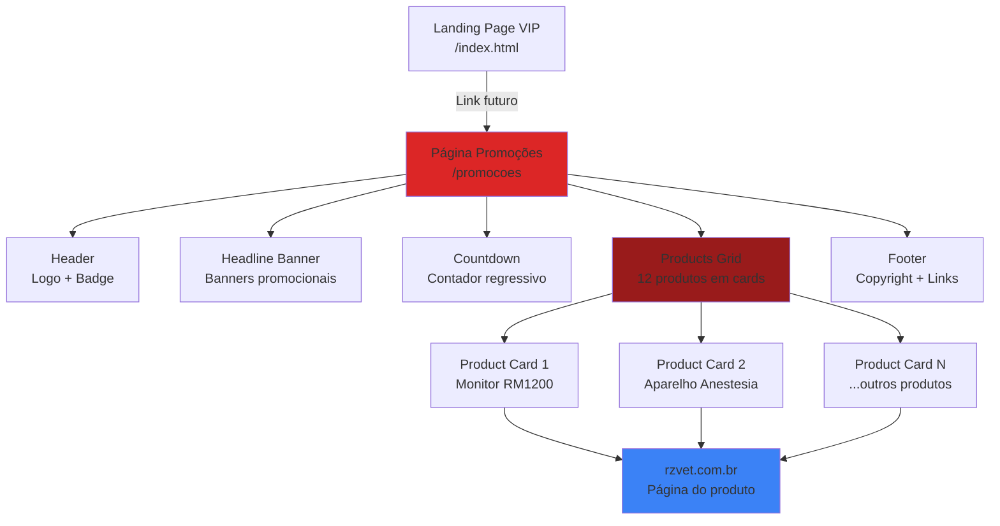
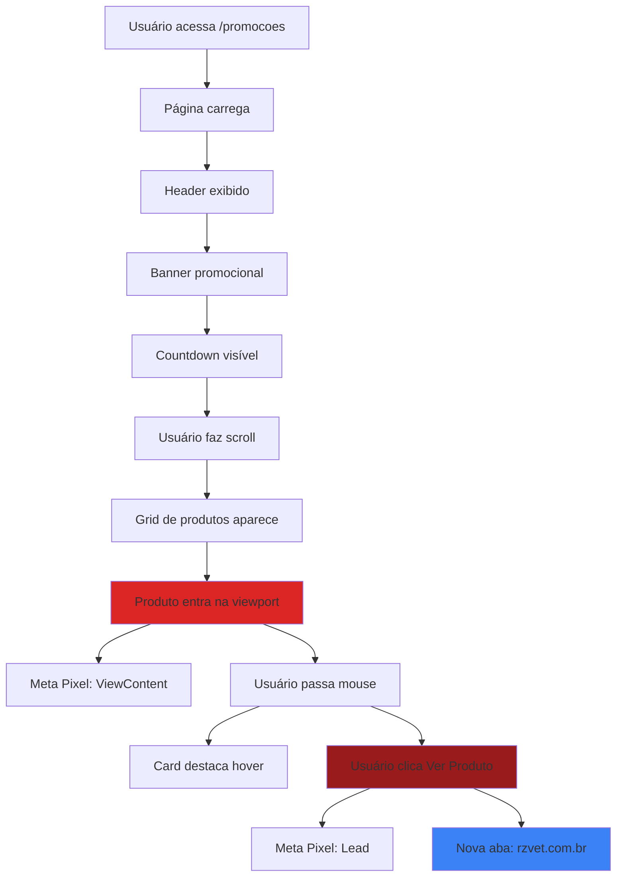
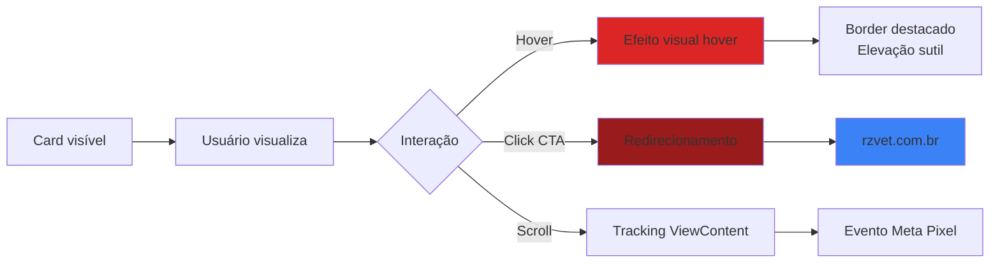

# Landing Page Black Friday RZ VET - UI/UX Specification

**Versão:** 1.0  
**Data:** 13 de Novembro de 2025  
**Status:** Aprovado

---

## 1. Introduction

Este documento define os objetivos de experiência do usuário, arquitetura de informação, fluxos de usuário e especificações de design visual para a página de promoções da Black Friday RZ VET. Serve como base para o desenvolvimento frontend, garantindo uma experiência coesa, profissional e pixel perfect, mantendo 100% de consistência visual com a landing page existente da lista VIP.

**Relacionamento com Outros Documentos:**
- **PRD:** `docs/prd.md` - Define requisitos funcionais e não funcionais
- **Architecture:** `docs/architecture.md` - Define arquitetura técnica e estrutura
- **Landing Page Existente:** `public/index.html` e `public/styles.css` - Referência visual obrigatória

---

### 1.1 Overall UX Goals & Principles

#### 1.1.1 Target User Personas

**Médico Veterinário / Proprietário de Clínica:**
- Profissional que busca equipamentos de alta qualidade para sua clínica
- Tem conhecimento técnico sobre equipamentos veterinários
- Precisa de informações claras sobre produtos, preços e especificações
- Valoriza descontos significativos e ofertas exclusivas
- Pode estar navegando em dispositivos móveis durante visitas ou em desktop no consultório

**Características:**
- Busca eficiência: quer encontrar produtos rapidamente
- Precisa de confiança: informações claras e precisas
- Sensível a preço: descontos são fator decisivo
- Tempo limitado: precisa de informações rápidas e objetivas

#### 1.1.2 Usability Goals

- **Eficiência de Descoberta:** Usuário encontra produtos relevantes em menos de 10 segundos
- **Clareza de Informação:** Preços, descontos e especificações são imediatamente compreensíveis
- **Facilidade de Navegação:** Scroll suave, cards organizados, botões claros
- **Confiança na Ação:** Botão "Ver Produto" é claramente identificável e confiável
- **Performance Percebida:** Página carrega rapidamente, imagens otimizadas
- **Acessibilidade:** Funciona perfeitamente com teclado e leitores de tela

#### 1.1.3 Design Principles

1. **Consistência Visual Absoluta** - Identidade visual idêntica à landing page existente
2. **Clareza sobre Estética** - Informações de produto sempre em primeiro plano
3. **Hierarquia Visual Clara** - Preços e descontos destacados, especificações organizadas
4. **Feedback Imediato** - Hover states, transições suaves, estados visuais claros
5. **Acessibilidade Inclusiva** - Design para todos, desde o início
6. **Performance Primeiro** - Design que não compromete velocidade

### 1.2 Change Log

| Date       | Version | Description                                    | Author        |
| ---------- | ------- | ---------------------------------------------- | ------------- |
| 2025-11-13 | 1.0     | Criação inicial da especificação de front-end | Equipe RZ VET |

---

## 2. Information Architecture (IA)

### 2.1 Site Map / Screen Inventory



### 2.2 Navigation Structure

**Primary Navigation:** N/A (página única, sem menu de navegação)

**Secondary Navigation:** N/A (página focada em produtos)

**Breadcrumb Strategy:** N/A (página única)

**Estrutura da Página:**
1. Header (fixo no topo)
2. Headline Banner (seção promocional)
3. Countdown (contador regressivo)
4. Products Grid (seção principal)
5. Footer (rodapé)

---

## 3. User Flows

### 3.1 Flow: Visualização de Produtos e Navegação

**User Goal:** Visualizar produtos em promoção e acessar informações detalhadas

**Entry Points:**
- URL direta: `/promocoes`
- Link futuro da landing page VIP

**Success Criteria:**
- Usuário vê todos os 12 produtos organizados
- Pode identificar preços e descontos claramente
- Consegue clicar em "Ver Produto" e ser redirecionado

**Flow Diagram:**



**Edge Cases & Error Handling:**
- Se `products.json` não carregar: Exibir mensagem "Produtos temporariamente indisponíveis"
- Se imagem não carregar: Exibir placeholder ou ocultar sem quebrar layout
- Se Meta Pixel falhar: Continuar funcionamento normal (não crítico)
- Se link do produto estiver quebrado: Abrir página mesmo assim (validação prévia)

**Notes:**
- Scroll suave e natural
- Lazy loading de imagens para performance
- Tracking de visualização quando produto entra na viewport

### 3.2 Flow: Interação com Card de Produto

**User Goal:** Explorar informações de um produto específico

**Entry Points:**
- Card visível no grid
- Scroll até o card

**Success Criteria:**
- Usuário vê todas as informações do produto claramente
- Pode identificar valor da promoção
- Consegue acessar página completa do produto

**Flow Diagram:**



**Edge Cases & Error Handling:**
- Card sem imagem: Layout mantém proporções
- Card sem preço original: Exibir apenas preço promocional
- Card sem especificações: Ocultar seção de specs

**Notes:**
- Hover deve ser sutil mas perceptível
- CTA deve ser claramente clicável
- Informações devem ser legíveis em todos os tamanhos de tela

---

## 4. Wireframes & Mockups

### 4.1 Design Files

**Primary Design Files:** N/A (design baseado na landing page existente)

**Referência Visual:** `public/index.html` e `public/styles.css`

**Abordagem:** Reutilizar 100% dos estilos existentes, criar novos apenas quando necessário para componentes específicos de produtos.

### 4.2 Key Screen Layouts

#### 4.2.1 Desktop Layout (≥ 1024px)

**Purpose:** Layout principal para desktop com grid de 3 colunas

**Key Elements:**
- Header fixo no topo (logo + badge)
- Headline banner full-width (300-500px altura)
- Countdown centralizado
- Products grid: 3 colunas, gap 1.5-2rem
- Footer no final

**Layout Structure:**
```
┌─────────────────────────────────────┐
│ HEADER (sticky)                     │
│ [Logo]           [Black Days 2025]  │
├─────────────────────────────────────┤
│ HEADLINE BANNER (full-width)        │
│ [Banner promocional]                │
├─────────────────────────────────────┤
│ COUNTDOWN (centered)                │
│ [Dias] [Horas] [Min] [Seg]          │
├─────────────────────────────────────┤
│ PRODUCTS GRID (3 columns)           │
│ [Card] [Card] [Card]                │
│ [Card] [Card] [Card]                │
│ [Card] [Card] [Card]                │
│ [Card] [Card] [Card]                │
├─────────────────────────────────────┤
│ FOOTER                              │
│ [Copyright] [Link rzvet.com.br]     │
└─────────────────────────────────────┘
```

**Interaction Notes:**
- Scroll suave entre seções
- Cards com hover effect
- Countdown atualiza a cada segundo

#### 4.2.2 Tablet Layout (768px - 1023px)

**Purpose:** Layout adaptado para tablets com grid de 2 colunas

**Key Elements:**
- Mesma estrutura, grid adaptado para 2 colunas
- Headline banner proporcional
- Cards mantêm proporções

**Layout Structure:**
```
┌──────────────────────────┐
│ HEADER                   │
├──────────────────────────┤
│ HEADLINE BANNER          │
├──────────────────────────┤
│ COUNTDOWN                │
├──────────────────────────┤
│ PRODUCTS GRID (2 cols)   │
│ [Card] [Card]            │
│ [Card] [Card]            │
│ [Card] [Card]            │
│ ...                      │
├──────────────────────────┤
│ FOOTER                   │
└──────────────────────────┘
```

**Interaction Notes:**
- Touch-friendly (botões maiores)
- Scroll otimizado para touch

#### 4.2.3 Mobile Layout (< 768px)

**Purpose:** Layout mobile-first com grid de 1 coluna

**Key Elements:**
- Grid de 1 coluna
- Cards full-width
- Headline banner adaptado
- Countdown em 2x2 grid

**Layout Structure:**
```
┌──────────────┐
│ HEADER       │
├──────────────┤
│ BANNER       │
├──────────────┤
│ COUNTDOWN    │
│ [D] [H]      │
│ [M] [S]      │
├──────────────┤
│ PRODUCTS     │
│ [Card]       │
│ [Card]       │
│ [Card]       │
│ ...          │
├──────────────┤
│ FOOTER       │
└──────────────┘
```

**Interaction Notes:**
- Botões facilmente clicáveis (min 44x44px)
- Scroll vertical suave
- Imagens otimizadas para mobile

---

## 5. Component Library / Design System

### 5.1 Design System Approach

**Design System Approach:** Reutilização total do design system existente da landing page VIP

**Filosofia:**
- **Zero Novos Estilos Base:** Reutilizar todas as variáveis CSS, cores, tipografia, espaçamentos
- **Componentes Específicos:** Criar apenas classes específicas para componentes de produto quando necessário
- **Consistência Absoluta:** Página deve parecer extensão natural da landing page

**Referência:**
- Variáveis CSS: `public/styles.css` (linhas 1-16)
- Classes existentes: `.container`, `.page-header`, `.header-layout`, `.brand-logo`, `.header-badge`, `.page-footer`, `.footer-layout`
- Padrões de card: `.preview-card`, `.highlight-card` (adaptar para produtos)

### 5.2 Core Components

#### 5.2.1 Product Card

**Purpose:** Exibir informações completas de um produto em promoção

**Variants:**
- Default: Produto disponível com todos os dados
- Sem preço original: Apenas preço promocional
- Sem especificações: Ocultar seção de specs

**States:**
- Default: Card normal, borda sutil
- Hover: Elevação sutil, borda destacada, sombra aumentada
- Focus: Outline para navegação por teclado
- Loading: Skeleton ou placeholder durante carregamento

**Usage Guidelines:**
- Sempre dentro do grid de produtos
- Imagem no topo do card
- Informações organizadas verticalmente
- CTA no final do card

**Estrutura HTML:**
```html
<article class="product-card">
  <div class="product-card__image">
    
    <span class="product-card__badge">-30%</span>
  </div>
  <div class="product-card__content">
    <h3 class="product-card__title">Nome do Produto</h3>
    <div class="product-card__pricing">
      <span class="product-card__price-original">R$ 15.000,00</span>
      <span class="product-card__price-promotional">R$ 10.500,00</span>
    </div>
    <ul class="product-card__specifications">
      <li>Especificação 1</li>
      <li>Especificação 2</li>
    </ul>
    <a href="..." class="product-card__cta btn-ver-produto" target="_blank" rel="noopener noreferrer">
      Ver Produto
    </a>
  </div>
</article>
```

**Estilos (baseados em `.preview-card` existente):**
- Fundo: `rgba(13, 13, 16, 0.94)` (mesmo da landing page)
- Borda: `1px solid rgba(148, 163, 184, 0.18)` (mesmo padrão)
- Border-radius: `22px` (mesmo da landing page)
- Padding: `1.35rem` (mesmo padrão)
- Hover: `transform: translateY(-3px)`, `border-color: rgba(248, 113, 113, 0.28)`

#### 5.2.2 Product Grid

**Purpose:** Container responsivo para exibir múltiplos product cards

**Variants:**
- Mobile: 1 coluna
- Tablet: 2 colunas
- Desktop: 3 colunas

**States:**
- Default: Grid visível
- Loading: Grid com placeholders
- Empty: Mensagem "Nenhum produto disponível"

**Usage Guidelines:**
- Sempre dentro de `.container` para largura máxima
- Gap entre cards: `1.5rem - 2rem`
- Centralizado horizontalmente

**Estrutura CSS:**
```css
.products-section {
  /* Reutilizar .container existente */
}

.products-grid {
  display: grid;
  gap: 1.5rem;
  grid-template-columns: 1fr; /* Mobile */
}

@media (min-width: 768px) {
  .products-grid {
    grid-template-columns: repeat(2, 1fr); /* Tablet */
  }
}

@media (min-width: 1024px) {
  .products-grid {
    grid-template-columns: repeat(3, 1fr); /* Desktop */
    gap: 2rem;
  }
}
```

#### 5.2.3 Discount Badge

**Purpose:** Destacar percentual de desconto

**Variants:**
- Default: Badge com percentual (ex: "-30%")
- Posicionamento: Canto superior direito do card ou próximo ao preço

**States:**
- Default: Badge visível
- Sem desconto: Ocultar badge

**Usage Guidelines:**
- Cor de destaque: `var(--accent-light)` ou `var(--accent)`
- Fonte: Bold, tamanho adequado para destaque
- Posicionamento absoluto no card ou inline com preço

**Estilos:**
```css
.product-card__badge {
  position: absolute;
  top: 1rem;
  right: 1rem;
  background: var(--accent);
  color: var(--text);
  padding: 0.4rem 0.8rem;
  border-radius: 999px;
  font-weight: 700;
  font-size: 0.85rem;
  text-transform: uppercase;
  letter-spacing: 0.05em;
}
```

#### 5.2.4 Product Pricing

**Purpose:** Exibir preços original e promocional

**Variants:**
- Com preço original: Mostrar ambos (original riscado, promocional destacado)
- Sem preço original: Apenas preço promocional

**States:**
- Default: Preços visíveis
- Formatado: Valores em Real brasileiro (R$ X.XXX,XX)

**Usage Guidelines:**
- Preço original: Riscado, cor mais clara (`var(--text-muted)`)
- Preço promocional: Maior, cor vibrante (`var(--text)` ou `var(--accent-light)`)
- Formatação: JavaScript para formatar valores

**Estrutura:**
```html
<div class="product-card__pricing">
  <span class="product-card__price-original">R$ 15.000,00</span>
  <span class="product-card__price-promotional">R$ 10.500,00</span>
</div>
```

#### 5.2.5 CTA Button "Ver Produto"

**Purpose:** Botão de ação principal para redirecionar ao produto

**Variants:**
- Default: Botão completo
- Hover: Efeito visual destacado
- Focus: Outline para acessibilidade

**States:**
- Default: Botão normal
- Hover: Elevação, sombra aumentada
- Active: Pressed state
- Focus: Outline visível

**Usage Guidelines:**
- Reutilizar estilos de `.submit-button` da landing page
- Texto: "Ver Produto"
- Link externo: `target="_blank"` e `rel="noopener noreferrer"`
- Ícone opcional: Seta indicando ação externa

**Estilos (baseados em `.submit-button`):**
```css
.btn-ver-produto {
  border: none;
  border-radius: 18px;
  padding: 1rem;
  font-size: 1.05rem;
  font-weight: 600;
  color: var(--text);
  background: linear-gradient(135deg, var(--accent) 0%, var(--accent-dark) 100%);
  box-shadow: 0 18px 40px rgba(220, 38, 38, 0.35);
  cursor: pointer;
  transition: transform 0.2s ease, box-shadow 0.2s ease;
  text-decoration: none;
  display: inline-block;
  text-align: center;
  width: 100%;
}

.btn-ver-produto:hover,
.btn-ver-produto:focus-visible {
  transform: translateY(-2px);
  box-shadow: 0 22px 50px rgba(220, 38, 38, 0.4);
}
```

#### 5.2.6 Headline Banner

**Purpose:** Área para banners promocionais no topo da página

**Variants:**
- Imagem única: Banner estático
- Carrossel: Múltiplos banners (futuro)

**States:**
- Default: Banner visível
- Loading: Placeholder durante carregamento

**Usage Guidelines:**
- Full-width da viewport
- Altura adaptável: 300-500px desktop, proporcional mobile
- Responsivo: Imagem adapta-se ao tamanho da tela

**Estrutura:**
```html
<section class="headline-banner">
  
</section>
```

#### 5.2.7 Countdown Component

**Purpose:** Exibir contador regressivo até início da promoção

**Variants:**
- Desktop: Grid 4 colunas (Dias, Horas, Min, Seg)
- Mobile: Grid 2x2

**States:**
- Running: Contador ativo, atualizando a cada segundo
- Finished: Mensagem "Promoção em andamento"

**Usage Guidelines:**
- Reutilizar estrutura e estilos do countdown da landing page
- Mesma lógica JavaScript (reutilizar função existente)
- Mesmos estilos visuais

**Estrutura (reutilizar da landing page):**
```html
<div class="countdown" data-target-date="2025-11-14T11:30:00-03:00">
  <span class="countdown__title">Contagem para o Black Days</span>
  <div class="countdown__grid">
    <!-- Reutilizar estrutura existente -->
  </div>
</div>
```

---

## 6. Branding & Style Guide

### 6.1 Visual Identity

**Brand Guidelines:** Identidade visual idêntica à landing page existente da lista VIP

**Princípio Fundamental:** A página de promoções deve parecer uma extensão natural da landing page, mantendo a mesma "cara" visual.

### 6.2 Color Palette

| Color Type | Hex Code      | CSS Variable          | Usage                                    |
| ---------- | ------------- | --------------------- | ---------------------------------------- |
| Background | `#070709`     | `--bg`                | Fundo principal da página                |
| Background Soft | `rgba(12, 12, 14, 0.94)` | `--bg-soft` | Fundo de seções, cards                   |
| Surface    | `rgba(255, 255, 255, 0.04)` | `--surface` | Superfícies sutis                        |
| Accent     | `#dc2626`     | `--accent`             | Cor principal, botões, destaques         |
| Accent Dark | `#991b1b`    | `--accent-dark`        | Gradientes, hover states                 |
| Accent Light | `#f87171`    | `--accent-light`       | Textos destacados, badges                 |
| Accent Soft | `rgba(248, 113, 113, 0.22)` | `--accent-soft` | Fundos sutis, bordas                     |
| Text       | `#f8fafc`     | `--text`               | Texto principal                         |
| Text Muted | `rgba(226, 232, 240, 0.76)` | `--text-muted` | Texto secundário, preços originais       |
| Border     | `rgba(248, 113, 113, 0.22)` | `--border` | Bordas principais                        |
| Border Soft | `rgba(148, 163, 184, 0.28)` | `--border-soft` | Bordas sutis                             |

**Nota:** TODAS as cores devem ser reutilizadas via variáveis CSS existentes. Nenhuma nova cor deve ser introduzida.

### 6.3 Typography

#### 6.3.1 Font Families

- **Primary:** Inter (Google Fonts)
- **Fallback:** `system-ui, -apple-system, BlinkMacSystemFont, "Segoe UI", sans-serif`
- **Monospace:** N/A (não utilizado)

**Fonte já configurada na landing page:** `public/index.html` linha 10

#### 6.3.2 Type Scale

| Element      | Size (Desktop) | Weight | Line Height | CSS Class/Usage              |
| ------------ | -------------- | ------ | ----------- | ---------------------------- |
| H1           | `clamp(2.3rem, 5vw, 3.35rem)` | 700    | 1.15        | Título principal (se houver) |
| H2           | `1.85rem`      | 600    | 1.2         | Títulos de seção             |
| H3           | `1.2rem`      | 600    | 1.3         | Nome do produto (card)        |
| Body         | `1rem`         | 400    | 1.5         | Texto geral                   |
| Small        | `0.92rem`      | 400    | 1.4         | Texto secundário, specs       |
| Button       | `1.05rem`      | 600    | 1.2         | Botões CTA                    |
| Badge        | `0.85rem`      | 700    | 1.2         | Badge de desconto             |

**Nota:** Reutilizar tamanhos e pesos da landing page existente. Valores acima são referência baseada em `styles.css`.

### 6.4 Iconography

**Icon Library:** N/A (não utiliza biblioteca de ícones)

**Usage Guidelines:**
- SVG inline quando necessário (ex: seta no botão "Ver Produto")
- Manter estilo minimalista
- Cores seguindo paleta (accent colors)

### 6.5 Spacing & Layout

**Grid System:**
- Container: `width: min(1100px, 92vw)`, `margin: 0 auto`
- Products Grid: Gap `1.5rem - 2rem` entre cards
- Seções: Padding vertical `clamp(2.5rem, 5vw, 4rem)`

**Spacing Scale:**
- Pequeno: `0.5rem - 0.75rem` (gaps internos)
- Médio: `1rem - 1.5rem` (paddings padrão)
- Grande: `2rem - 3rem` (gaps entre seções)
- Extra Grande: `4rem - 5rem` (espaçamento de seções principais)

**Reutilizar:** Espaçamentos da landing page existente via classes `.container`, padrões de padding.

---

## 7. Accessibility Requirements

### 7.1 Compliance Target

**Standard:** WCAG AA (nível mínimo)

**Justificativa:** PRD NFR3 especifica WCAG AA como requisito mínimo.

### 7.2 Key Requirements

**Visual:**
- Color contrast ratios: Mínimo 4.5:1 para texto normal, 3:1 para texto grande
- Focus indicators: Outline visível em todos os elementos interativos (mínimo 2px)
- Text sizing: Texto legível sem zoom (mínimo 16px para body)

**Interaction:**
- Keyboard navigation: Todos os elementos interativos devem ser focáveis e navegáveis por Tab
- Screen reader support: Estrutura semântica HTML, aria-labels onde necessário
- Touch targets: Mínimo 44x44px para botões e links em mobile

**Content:**
- Alternative text: Todas as imagens devem ter `alt` text descritivo
- Heading structure: Hierarquia lógica (h1 → h2 → h3)
- Form labels: N/A (página não tem formulários)

**Especificações Adicionais:**
- Cards de produto: Usar `<article>` para semântica
- Botões: Usar `<a>` ou `<button>` apropriadamente
- Links externos: `rel="noopener noreferrer"` e indicar visualmente que abre em nova aba
- Imagens: `loading="lazy"` para performance, `alt` descritivo

### 7.3 Testing Strategy

**Ferramentas:**
- axe DevTools (extensão navegador)
- WAVE (Web Accessibility Evaluation Tool)
- Lighthouse (auditoria acessibilidade)
- Navegação por teclado manual
- Leitor de tela (NVDA, JAWS, VoiceOver)

**Checklist de Validação:**
- [ ] Todos os elementos interativos focáveis por teclado
- [ ] Ordem de tab lógica
- [ ] Contraste de cores validado
- [ ] Alt text em todas as imagens
- [ ] Estrutura semântica HTML correta
- [ ] Leitor de tela funciona corretamente

---

## 8. Responsiveness Strategy

### 8.1 Breakpoints

| Breakpoint | Min Width | Max Width | Target Devices                    |
| ---------- | --------- | --------- | --------------------------------- |
| Mobile     | 320px     | 767px     | Smartphones (iPhone SE, iPhone 12/13, Android) |
| Tablet     | 768px     | 1023px    | Tablets (iPad, iPad Mini)         |
| Desktop    | 1024px    | 1279px    | Laptops, desktops pequenos        |
| Wide       | 1280px    | -         | Desktops grandes, monitores wide  |

**Nota:** Breakpoints baseados em padrões comuns e alinhados com PRD NFR2.

### 8.2 Adaptation Patterns

**Layout Changes:**
- Mobile: Grid 1 coluna, cards full-width, countdown 2x2
- Tablet: Grid 2 colunas, cards proporcionais, countdown 4 colunas
- Desktop: Grid 3 colunas, cards proporcionais, countdown 4 colunas

**Navigation Changes:**
- N/A (sem menu de navegação)

**Content Priority:**
- Mobile: Headline banner pode ser reduzido, produtos em destaque
- Desktop: Todos os elementos visíveis, layout espaçado

**Interaction Changes:**
- Mobile: Touch-friendly (botões maiores, áreas de toque generosas)
- Desktop: Hover states ativos, interações mais refinadas

**Imagens:**
- Mobile: Imagens otimizadas, lazy loading
- Desktop: Imagens em qualidade completa, lazy loading abaixo da dobra

---

## 9. Animation & Micro-interactions

### 9.1 Motion Principles

- **Sutil e Profissional:** Animações discretas, não distraem do conteúdo
- **Performance First:** Animações leves, 60fps garantido
- **Propósito Claro:** Cada animação serve a um propósito (feedback, orientação)
- **Acessibilidade:** Respeitar `prefers-reduced-motion`

### 9.2 Key Animations

- **Card Hover:** `transform: translateY(-3px)`, `border-color` transition, `box-shadow` increase
  - Duration: `0.2s ease`
  - Easing: `ease` (padrão CSS)

- **Button Hover:** `transform: translateY(-2px)`, `box-shadow` increase
  - Duration: `0.2s ease`
  - Easing: `ease`

- **Page Load:** Fade-in suave (opcional)
  - Duration: `0.3s ease-in`
  - Easing: `ease-in`

- **Image Load:** Fade-in quando imagem carrega (lazy loading)
  - Duration: `0.3s ease-in`
  - Easing: `ease-in`

**Nota:** Reutilizar transições da landing page existente. Valores baseados em `styles.css`.

**Respeitar Preferências:**
```css
@media (prefers-reduced-motion: reduce) {
  * {
    animation-duration: 0.01ms !important;
    animation-iteration-count: 1 !important;
    transition-duration: 0.01ms !important;
  }
}
```

---

## 10. Performance Considerations

### 10.1 Performance Goals

- **Page Load:** < 3 segundos em conexão 4G (PRD NFR1)
- **First Contentful Paint:** < 2 segundos
- **Largest Contentful Paint:** < 2.5 segundos
- **Interaction Response:** < 100ms para hover/clicks
- **Animation FPS:** 60fps constante

### 10.2 Design Strategies

**Otimizações de Imagem:**
- Lazy loading: `loading="lazy"` em todas as imagens abaixo da dobra
- Formato WebP: Converter quando possível, fallback PNG/JPG
- Compressão: Reduzir tamanho sem perda significativa de qualidade
- Tamanhos adequados: Não carregar imagens maiores que necessário

**CSS:**
- Reutilizar CSS existente (não duplicar)
- Adicionar apenas estilos específicos necessários
- Minificar para produção

**JavaScript:**
- Carregar `products.json` de forma assíncrona
- Renderização eficiente (evitar reflows desnecessários)
- Debounce/throttle em eventos de scroll (Intersection Observer)

**Fontes:**
- Preload de fontes críticas (já configurado na landing page)
- `font-display: swap` para evitar FOIT

---

## 11. Next Steps

### 11.1 Immediate Actions

1. Revisar esta especificação com stakeholders
2. Validar wireframes e layouts propostos
3. Confirmar reutilização de estilos da landing page
4. Iniciar desenvolvimento seguindo esta especificação

### 11.2 Design Handoff Checklist

- [x] Todos os user flows documentados
- [x] Component inventory completo
- [x] Accessibility requirements definidos
- [x] Responsive strategy clara
- [x] Brand guidelines incorporadas (reutilização total)
- [x] Performance goals estabelecidos
- [x] Especificações de componentes detalhadas
- [x] Estados de interação definidos
- [x] Breakpoints e adaptações documentados

### 11.3 Development Guidelines

**Para o Desenvolvedor:**

1. **SEMPRE reutilizar estilos existentes** antes de criar novos
2. **Consultar `public/styles.css`** para referência de classes e variáveis
3. **Manter identidade visual idêntica** à landing page
4. **Testar em todos os breakpoints** antes de considerar completo
5. **Validar acessibilidade** com ferramentas e navegação por teclado
6. **Otimizar performance** (lazy loading, compressão de imagens)

**Arquivos de Referência:**
- `public/index.html` - Estrutura HTML da landing page
- `public/styles.css` - Todos os estilos existentes
- `public/app.js` - JavaScript existente (reutilizar funções quando possível)

---

## 12. Document Status

**Status:** ✅ Especificação de front-end completa e aprovada

**Documentos Relacionados:**
- PRD: `docs/prd.md` - Requisitos funcionais e não funcionais
- Architecture: `docs/architecture.md` - Arquitetura técnica
- Este documento: Especificações visuais e de UX

**Pronto para Implementação:**
- Todas as especificações de componentes definidas
- Wireframes e layouts documentados
- Diretrizes de design estabelecidas
- Referências visuais identificadas

---

**Fim do Documento**

